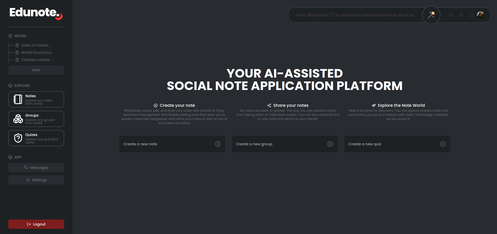

This project aims to create a web application that enables users to take notes from various sources such as YouTube, PDFs, and audio recordings, using AI to generate notes automatically. Additionally, users can search for notes within their collection and a public database of notes.

## Demo

*Available soon...*


## Features

- **Note-taking from multiple sources:** Text, PDFs, Word documents, audio recordings, images.
- **AI-powered note creation:** Converting audio or video to text, summarizing text, extracting keywords, topic classification.
- **Collaboration:** Share your notes in public and reach others.
- **Personalization:** Improved user experience with learning-based features with Gemini to create notes in personalized styles.
- **Smart search:** Search for public notes or specific information in your notes. Full-text search, semantic search, filtering, suggested searches.
- **Integrations:** Integration with other applications (Google Drive, Evernote, Zoom, etc.).


## Screenshots




## API Reference

<details>
<summary> <b> <samp> See API Reference </samp></b></summary>
<samp>
<br>

### Gemini Operation

#### Interact with Gemini AI

```http
  POST /gemini/
```

| Parameter | Type     | Description                |
| :-------- | :------- | :------------------------- |
| `option	` | `string` | The type of content generation to perform. |
| `prompt` | `string` | **Required**. The input text to be processed. |
| `command` | `string` | **Optional** command for further processing. |
| `user_id` | `string` | **Required**. User ID for tracking interactions. |
| `note_id` | `string` | Default is 'gemini'. Note ID for context. |
| `user_query` | `string` | Specific query related to the prompt. |

### Chat History Operations

#### Retrieve Chat History

```http
  GET /chat/history/
```
| Parameter | Type     | Description                       |
| :-------- | :------- | :-------------------------------- |
| `user_id`      | `string` | **Required**. User ID for which to retrieve chat history. |
| `note_id`      | `string` | **Optional**. Note ID to specify the context of the chat. |

#### GET /chat/clear/

```http
  GET /chat/clear/
```

| Parameter | Type     | Description                       |
| :-------- | :------- | :-------------------------------- |
| `user_id`      | `string` | **Required**. User ID for which to clear chat history. |
| `note_id`      | `string` | **Optional**. Note ID to specify the context of the chat. |

### Elasticsearch Operations

#### Chat with Gemini in Notes

```http
  POST /search/ask/
```

| Parameter | Type     | Description                       |
| :-------- | :------- | :-------------------------------- |
| `query`      | `string` | **Required**. The specific search query. |
| `user_id`      | `string` | **Required**. User ID to filter the search results. |
| `public_search`      | `boolean` | **Optional**. Defaults to 'false'. Flag to indicate if public notes should be included. |

#### Simple Search

```http
  POST /search/simple/
```

| Parameter | Type     | Description                       |
| :-------- | :------- | :-------------------------------- |
| `query`      | `string` | **Required**. The search query string. |

#### Detailed Search

```http
  POST /search/all/
```

| Parameter | Type     | Description                       |
| :-------- | :------- | :-------------------------------- |
| `body`      | `object` | **Required**. JSON body containing the search criteria. |

### File Operations

#### Extract Transcript from YouTube Video

```http
  POST /caption/extract/
```

| Parameter | Type     | Description                       |
| :-------- | :------- | :-------------------------------- |
| `youtube_video_id`      | `string` | **Required**. The ID of the YouTube video from which to extract captions. |
| `only_transcript`      | `boolean` | **Optional**. Flag to indicate if only the transcript should be extracted. |

#### Extract Text from File

```http
  POST /file/extract/
```

| Parameter | Type     | Description                       |
| :-------- | :------- | :-------------------------------- |
| `file`      | `UploadFile` | **Required**. The file from which text will be extracted. |

**Supported File Extensions:**
- Audio: `mp3`, `wav`, `aac`, `m4a`, `wma`
- Pdf: `pdf`
- Image: `jpg`, `jpeg`, `png`, `gif`, `webp`, `svg`


#### Check File Existence

```http
  POST /file/check/
```

| Parameter | Type     | Description                       |
| :-------- | :------- | :-------------------------------- |
| `user_id`      | `string` | **Required**. User ID for tracking the file. |
| `file_name`      | `string` | **Required**. Name of the file to check if exists. |

#### Download File

```http
  POST /file/download/
```

| Parameter | Type     | Description                       |
| :-------- | :------- | :-------------------------------- |
| `user_id`      | `string` | **Required**. User ID for tracking the file. |
| `file_name`      | `string` | **Required**. Name of the file to be downloaded. |

#### Upload Files

```http
  POST /file/upload/
```

| Parameter | Type     | Description                       |
| :-------- | :------- | :-------------------------------- |
| `user_id`      | `string` | **Required**. User ID for tracking the file. |
| `if_exists`      | `boolean` | **Optional**. Defaults to 'False'. Flag to indicate if the file should be replaced if it already exists. |
| `files`      | `List<UploadFile>` | **Required**. List of files to be uploaded. |

</samp>
</details>

## License

[Creative Commons Attribution-NonCommercial-NoDerivatives 4.0 International](LICENSE)

<!-- ## Tech Stack

**Client:** React, Redux, TailwindCSS

**Server:** Node, Express -->

## Support

For support, email to [eray.ates@outlook.com](mailto:eray.ates@outlook.com) or [orhun868@gmail.com](mailto:orhun868@gmail.com).


## Contributing

Please contact to contribute.

See [`CONTRIBUTING.md`](.github/CONTRIBUTING.md) for ways to get started.

Please adhere to this project's [`CODE_OF_CONDUCT.md`](.github/CODE_OF_CONDUCT.md).

